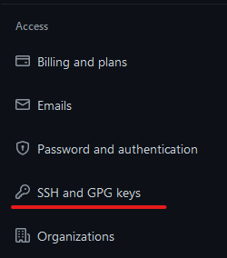

# Github

In diesem Dokument sammel ich Dinge, die explizit mit **github** zusammenhängen (nicht nur **git**).

## SSH Key für Github
1. Check, ob schon ein ssh-Schlüssel existiert:
   ~~~ bash
   // Git Bash
   $ ls -al ~/.ssh
   ~~~
   Schaue, ob eine Datei
   * `id_rsa.pub`
   * `id_ecdsa.pub`
   * `id_ed25519.pub`
   
   existiert.
2. Wenn keiner existiert, erstelle einen neuen:
   1. öffne eine Bash (z.B. Git Bash)
   2. Erzeuge einen Schlüssel mit der gegebenen email als Label
        ~~~ bash
      // Git Bash
      $ ssh-keygen -t ed25519 -C "<your_email@example.com>"
      ~~~
   3. In der öffnenden Maske gib einen *passphase* ein
3. Für den Auto-Start von `ssh-agent` für Git für Windows füge in der Git shell in die Datei `~/.profile`
   ein: (man kann dann auch den Schlüssel das WSL-Homes kopieren und folgendes auch dort in die .profile)
   ~~~ bash
   env=~/.ssh/agent.env

   agent_load_env () { test -f "$env" && . "$env" >| /dev/null ; }

   agent_start () {
      (umask 077; ssh-agent >| "$env")
      . "$env" >| /dev/null ; }

   agent_load_env

   # agent_run_state: 0=agent running w/ key; 1=agent w/o key; 2=agent not running
   agent_run_state=$(ssh-add -l >| /dev/null 2>&1; echo $?)

   if [ ! "$SSH_AUTH_SOCK" ] || [ $agent_run_state = 2 ]; then
      agent_start
      ssh-add
   elif [ "$SSH_AUTH_SOCK" ] && [ $agent_run_state = 1 ]; then
      ssh-add
   fi

   unset env
   ~~~
4. Füge den SSH Schlüssel dem GitHub-Account hinzu
   1. Kopiere den *public key* ins Clipboard
      ~~~ bash
      // Git Bash
      $ clip < ~/.ssh/id_ed25519.pub
      ~~~
   2. In GitHub (webbrowser) öffne **Settings**
      
      
   3. Unter **Access** wähle **SSH and GPG keys**
      
   4. Wähle **New SSH key**
   5. Gib einen sinnvollen Titel ein, z.B. *JensRM bei INIT Software*
   6. Paste den kopierten Schlüssel in das dafür vorgesehene Feld ein
   7. Schließe ab mit **Add SSH key**
   8. Gib das GitHub-Passwort ein
      

   

## Token für Github benutzen

## Github Desktop und CLI